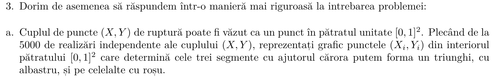
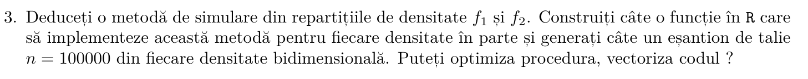

# Prerequisites
Setam environment pentru R markdown

```r
knitr::opts_chunk$set(fig.width = 10, fig.height = 10)
```
Initializam figurile/ploturile sa fie 1000x1000 ca dimensiune.

# Header


# Nota

acest proiect contine fisierul `raport.Rmd` plus `raport.html` si `raport.docx` care sunt fisierele generate cu RMarkdown compiler.

# Problema 1

### nota problema 1

Pentru problema 1 am creat o colectie de functii utile care pot fi reutilizate. Principul din spate se numeste `functional programming`.

Functie pentru extragerea de cei 2 minimi si maximul dintre valorile `(a, b, c)`.

```r
get_min_max_2nd_min <- function(a, b, c) {
    # punem valorile intr-un array
    values <- c(a, b, c)
    # luam minim
    minimum <- min(values)
    # luam maxim
    maximum <- max(values)
    # alfam al doilea min
    # '! values %in% c(minimum)' inseamna toate valorile care nu sunt in vectorul c(minimum)
    # adica doar vectorul cu valoarea minima
    second_min <- min(values[! values %in% c(minimum)])
    # returnam un vector to toate valorile in ordine crescatoare
    # bune pentru formula de triunghi obtuz
    return (c(minimum, second_min, maximum))
}
```

Functie pentru verificarea conditiei de `triunghi obtuz` din setul de 3 lungimi `(a, b, c)`.

```r
is_obtuse_triangle <- function(a, b, c) {
    # formula este
    # min^2 + second_min^2 < max^2 -> if TRUE then obtuz else 'nu e obtuz'

    # luam valorile si le ridicam la patrat pentru formula
    values <- get_min_max_2nd_min(a, b, c) ^ 2
    # membrul stang al egalitatii
    min_sum <- values[1] + values[2]

    # daca suma minimelor < max^2
    if (min_sum < values[3]) {
        # obtuz
        return (TRUE)
    }
    # not obtuz
    return (FALSE)
}
```

Functie pentru verificarea conditiei de `triunghi` din setul de 3 lungimi `(a, b, c)`.

```r
is_triangle <- function(a, b, c) {
    # daca toate laturile sunt mai mici decat 1 pe 2 (0.5)
    if (a <= 0.5 && b <= 0.5 && c <= 0.5) {
        # triunghi
        return (TRUE)
    }
    # non-triunghi
    return (FALSE)
}
```

## Cerinta


Pentru inceput setam variable esentiale pentru intreaga executie a problemei numarul 1.

```r
total <- 5000 # nr total de simulari
swap <- TRUE # pentru inversarea lui X si Y atunci cand X > Y
```

## Procedura 1


## Procedura 1 - Punctul 1


Functia pentru generare x si y aleator si uniform din [0, 1]

```r
generate_xy <- function(total = 5000) {
    # 5000 individual unique random values between [0, 1]
    x <- runif(total, 0, 1)
    # 5000 individual unique random values between [0, 1]
    y <- runif(total, 0, 1)
    # why dataframe?
    # its much easier to manage
    return (data.frame(x = x, y = y))
}
```

Functia pentru generare dataframe cu toate coloanele necesare in toata problema

exemplu:

```r
##            x         y          a         b          c   color triangle obtuse
## 1 0.50215305 0.3469016 0.34690161 0.1552514 0.49784695 #E5C07B     TRUE   TRUE
## 2 0.40636783 0.7485510 0.40636783 0.3421832 0.25144896 #61AFEF     TRUE  FALSE
## 3 0.59089269 0.4732470 0.47324695 0.1176457 0.40910731 #E5C07B     TRUE   TRUE
## 4 0.73110424 0.3785572 0.37855720 0.3525470 0.26889576 #61AFEF     TRUE  FALSE
## 5 0.02923464 0.2987789 0.02923464 0.2695443 0.70122107 #E06C75    FALSE  FALSE
## 6 0.07148460 0.9297189 0.07148460 0.8582343 0.07028107 #E06C75    FALSE  FALSE
```
O sa avem un dataframe identic deoarece dorim sa salvam valorile x, y, a, b, c;
ce culori sa aiba pentru fiecare pereche;
daca este triunghi sau nu si daca sunt este obtuz sau nu.


```r
generate_dataframe <- function(
    dataframe,
    swap = FALSE
) {
    # avem nevoie de un dataframe cu toate valorile respective pe coloane
    # pentru a le avea pe toate intr-o singura colectie sa fie mai usor de operat
    pairs = list(list(dataframe$x), list(dataframe$y))
    # culori, rosu sau albastru
    colors = c()
    # valori bool pentru triunghi
    triangle = c()
    # valori bool pentru triunghi obtuz
    obtuse = c()
    # array urile cu lungimi
    aa <- c()
    bb <- c()
    cc <- c()
    for (iter in seq_len(length(dataframe$y))) {
        # print(iter)
        x <- pairs[[1]][[1]][iter]
        y <- pairs[[2]][[1]][iter]

        # le face swap pentru nu are sens
        # dpdv matematic si alfabetic sa fie X > Y
        # cand pe axa avem in ordine (0, X) (X, Y) (Y, 1)
        if (swap) {
            if (x > y) {
                z <- x
                x <- y
                y <- z
            }
        }

        # generam lungimile pentru un triunghi
        a <- x
        b <- abs(x - y)
        c <- abs(1 - y)

        # punem valorile in array uri
        aa <- append(aa, a)
        bb <- append(bb, b)
        cc <- append(cc, c)

        # check if the a, b, c lengths form a triangle
        if (is_triangle(a, b, c)) {
            triangle <- append(triangle, TRUE)
            colors <- append(colors, "#61AFEF")

            # check if the a, b, c lengths form an obtuse triangle
            if (is_obtuse_triangle(a, b, c)) {
                obtuse <- append(obtuse, TRUE)
                # am pus cele obtuze cu galben sa fie mai usor
                # de vizualizat
            } else {
                obtuse <- append(obtuse, FALSE)
            }
        } else {
            # have to initialize with default values
            colors <- append(colors, "#E06C75")
            triangle <- append(triangle, FALSE)
            obtuse <- append(obtuse, FALSE)
        }
    }
    # punem toate coloanele in dataframe
    dataframe[,"a"] <- aa
    dataframe[,"b"] <- bb
    dataframe[,"c"] <- cc
    dataframe[,"color"] <- colors
    dataframe[,"triangle"] <- triangle
    dataframe[,"obtuse"] <- obtuse
    return (dataframe)
}
```
---

### Punctul 1 solutie

### Justificare teoretica

ramane pentru vlad si bogdan

### Justificare practica

```r
# generam valorile x si y
xy <- generate_xy()

# cream dataframe cu tot ce am obtinut
dataframe <- generate_dataframe(
    xy,
    swap=swap)

total_triangles <- length(which(dataframe$triangle==TRUE))
```
Observam ca avem numar triunghiuri > 0, deci am aratat practic ca se pot forma triungiuri.


### Functii utile pentru problema 1
functiile pentru probabilitati

```r
# functia pentru probabilitatea de triunghiuri
get_total_triangles_probability <- function(dataframe, total) {
    # numaram in dataframe care valori sunt true in vectorul de boolene
    total_triangles = length(which(dataframe$triangle==TRUE))
    # cazuri fav pe posibile
    return (total_triangles / total)
}


# probabilitatea pentru obtuze din toate puncturile
get_total_obtuses_probability_from_all_points <- function(dataframe, total) {
    # numaram in dataframe care valori sunt true in vectorul de boolene
    total_triangles = length(which(dataframe$obtuse==TRUE))
    # cazuri fav pe posibile
    # probabilitatea pentru triunghiuri obtuze din toate toate punctele
    return (total_triangles / total)
}

# functia pentru probabilitatea de triunghiuri obtuze
get_total_obtuses_probability_from_all_triangles <- function(dataframe, total) {
    total_triangles = length(which(dataframe$triangle==TRUE))
    total_obtuses = length(which(dataframe$obtuse==TRUE))
    # probabilitatea pentru triunghiuri obtuze din toate triunghiurile
    return (total_obtuses / total_triangles)
}
```

Functia pentru lungimiile medii

```r
# functia care face media lungimilor a, b, c
get_mean_lengths <- function(dataframe) {
    # mediile pentru (a1, a2, ..., an)
    as_mean = paste("all a's mean: ", mean(dataframe$a), sep="")
    print(as_mean)
    # mediile pentru (b1, b2, ..., bn)
    bs_mean = paste("all b's mean: ", mean(dataframe$b), sep="")
    print(bs_mean)
    # mediile pentru (c1, c2, ..., cn)
    cs_mean = paste("all c's mean: ", mean(dataframe$c), sep="")
    print(cs_mean)
}
```


## Procedura 1 - Punctul 2


### Solutie

#### Justificare teoretica

ramane pentru vlad si bogdan

#### Justificare practica
Folosim tot ce am generat punctele anterioare
si apelam functia creata pentru acest punct.

```r
# means for a, b, c
get_mean_lengths(dataframe)
```

```
## [1] "all a's mean: 0.336544737908663"
## [1] "all b's mean: 0.325856696138997"
## [1] "all c's mean: 0.33759856595234"
```
Dupa cum observati, valorile lugimilor medii sunt intotdeauna `0.33` approximativ.
Uneori mai apare si `0.32` sau `0.34`.


## Procedura 1 - Punctul 3.a


### Solutie

```r
# avem nevoie de nr total de obtuze si triunghiuri pentru a face un plot mai sugestiv
total_triangles <- length(which(dataframe$triangle==TRUE))
triangle_prob <- get_total_triangles_probability(dataframe, total)

# cream titlu pentru plot
main_text <- paste(
    "(X, Y) @ [0, 1] -> range: ",
    total,
    "\n",
    "total_triangles: ",
    total_triangles,
    " | ",
    triangle_prob, "%",
    sep="")

white <- "#ABB2BF"
# setam culoare de background si foreground pentru plot
par(bg = "#282C34", fg=white)

# plotam rezultatele finale
plot(
    x = dataframe$x,
    y = dataframe$y,
    xlab = "X",
    ylab = "Y",
    xlim = c(0,1.1),
    ylim = c(0,1.1),
    main = main_text, # titlu pentru plot
    col.main = white,
    col.sub = white,       # Subtitle color
    col.lab = white,    # X and Y-axis labels color
    col.axis = white,   # Tick labels color
    col = dataframe$color,
    pch = 16,
    cex = 1.5,
    cex.main = 1.5,   # Title size
    cex.sub = 0.5,  # Subtitle size
    cex.lab = 2,   # X-axis and Y-axis labels size
    cex.axis = 1, # Axis labels size
    # family = "monaco"
)
```

<!-- -->
---
Plotare pentru 5000 de generari random de X si Y din Uniform[0, 1]. Graficul este simetric deci inseamna ca este corect. Daca nu facem swap la valorile X si Y atunci graficul este asimetric, deci incorect.


## Procedura 1 - Punctul 3.b


### Solutie

```r
# calcuam probabilitatea pentru formare triunghiuri
triangle_prob <- get_total_triangles_probability(dataframe, total)
cat(triangle_prob)
```

```
## 0.2534
```
Dupa cum observati, este mereu approx `0.25%`, adica `1/4`. Uneori este si `0.24` sau `0.26`.

## Procedura 1 - Punctul 3c


### Justificare teoretica
ramane de facut pentru `vlad` si `bogdan`


## Procedura 1 - Punctul 4


### Solutie

### Justificare teoretica

ramane pentru vlad si bogdan


### Justificare practica

```r
# calcuam probabilitatea pentru formare triunghiuri obtuze din toate punctele
obtuses_prob_from_all_points <- get_total_obtuses_probability_from_all_points(dataframe, total)
print(obtuses_prob_from_all_points)
```

```
## [1] 0.1706
```

```r
# calcuam probabilitatea pentru formare triunghiuri obtuze doar din triunghiuri
obtuses_prob_from_triangles <- get_total_obtuses_probability_from_all_triangles(dataframe, total)
print(obtuses_prob_from_triangles)
```

```
## [1] 0.6732439
```
Dupa observati, probabilitatea este mereu approx cu `0.67%`, evident, probabilitatea de formare a triunghiurile obtuze din `toate triunghirile` formate.


## Procedura 2


Singura diferenta fata de procedura 1 este modul in care alegem X si Y, in rest toate functiile aplicabile raman la fel. De aceea, au fost facut si asa, pentru reutilizare.

```r
generate_xy_punctul_4 <- function(total = 5000) {
    # 5000 individual unique random values between [0, 1]
    x <- runif(total, 0, 1)
    y <- c()
    for (xx in x) {
        diff_from_0_to_x <- xx
        diff_from_x_to_1 <- abs(1 - xx)
        if (diff_from_0_to_x > diff_from_x_to_1) {
            yy <- runif(1, min=0, max=xx)
        } else {
            yy <- runif(1, min=xx, max=1)
        }
        y <- append(y, yy)
    }
    # why dataframe?
    # its much easier to manage
    return (data.frame(x = x, y = y))
}
```

Generam valorile x si y.

```r
xy <- generate_xy_punctul_4()

# cream dataframe cu tot ce am obtinut
dataframe <- generate_dataframe(
    xy,
    swap=swap)

head(dataframe)
```

```
##            x         y          a          b           c   color triangle
## 1 0.97777946 0.8885423 0.88854227 0.08923719 0.022220535 #E06C75    FALSE
## 2 0.01016626 0.4975211 0.01016626 0.48735480 0.502478939 #E06C75    FALSE
## 3 0.89542234 0.7499279 0.74992788 0.14549446 0.104577656 #E06C75    FALSE
## 4 0.92241629 0.8053539 0.80535389 0.11706240 0.077583710 #E06C75    FALSE
## 5 0.99436049 0.8056849 0.80568492 0.18867558 0.005639506 #E06C75    FALSE
## 6 0.44771597 0.6364131 0.44771597 0.18869708 0.363586946 #61AFEF     TRUE
##   obtuse
## 1  FALSE
## 2  FALSE
## 3  FALSE
## 4  FALSE
## 5  FALSE
## 6   TRUE
```
Am generat valorile si le-am pus in dataframe si am printat primele 6 linii ale dataframe-ului.


## Procedura 2 - Punctul 5


adica aflarea probabilitatii pentru nr total de triunghiuri si demonstratia teoretic

### Solutie
### Justificare teoretica
ramane pentru vlad si bogdan

### Justificare practica

Plotam sa vedem distributia de triunghiuri.

```r
total_triangles <- length(which(dataframe$triangle==TRUE))
triangle_prob <- get_total_triangles_probability(dataframe, total)

# adaugam titlu pentru plot
main_text <- paste(
    "(X, Y) @ [0, 1] -> range: ",
    total,
    "\n",
    "total_triangles: ",
    total_triangles,
    " | ",
    triangle_prob, "%",
    "\n",
    sep="")

# punctul 3.a
size <- 600
white <- "#ABB2BF"
# setam culoare de background si foreground pentru plot
par(bg = "#282C34", fg=white)

# plotam rezultatele finale
plot(
    x = dataframe$x,
    y = dataframe$y,
    xlab = "X",
    ylab = "Y",
    xlim = c(0,1.1),
    ylim = c(0,1.1),
    main = main_text,
    col.main = white,
    col.sub = white,       # Subtitle color
    col.lab = white,    # X and Y-axis labels color
    col.axis = white,   # Tick labels color
    col = dataframe$color,
    pch = 16,
    cex = 1.5,
    cex.main = 1.5,   # Title size
    cex.sub = 0.5,    # Subtitle size
    cex.lab = 2,      # X-axis and Y-axis labels size
    cex.axis = 1,     # Axis labels size
    # family = "monaco"
)
```

<!-- -->

calculam probabiliatea de formare pentru triunghiuri cu noua metoda de alegere

```r
total_triangles_prob <- get_total_triangles_probability(dataframe, total)
print(total_triangles_prob)
```

```
## [1] 0.3816
```
Dupa cum se observa probabilitatea este mereu approx cu `0.38%`


## Procedura 2 - Punctul 6


Nu are sens. Este exact ca la procedura 1. Daca citim cerinta o sa reiasa ca rezolvarea este exact la la procedura 1.

Functia de generate X si Z.

```r
generate_xz <- function(total = 5000) {
    # 5000 individual unique random values between [0, 1]
    x <- runif(total, 0, 1)
    # 5000 individual unique random values between [0, 1]
    z <- runif(total, 0, 1)
    # why dataframe?
    # its much easier to manage
    return (data.frame(x = x, y = z))
}
```

Generam valorile X si Z si le salvam in dataframe.

```r
# generam valorile x si z
xz <- generate_xz()

# cream dataframe cu tot ce am obtinut
dataframe <- generate_dataframe(
    xz,
    swap=swap)

head(dataframe)
```

```
##           x         y         a         b           c   color triangle obtuse
## 1 0.7460684 0.5254203 0.5254203 0.2206482 0.253931565 #E06C75    FALSE  FALSE
## 2 0.7539250 0.1574868 0.1574868 0.5964382 0.246075001 #E06C75    FALSE  FALSE
## 3 0.7007661 0.9924278 0.7007661 0.2916617 0.007572188 #E06C75    FALSE  FALSE
## 4 0.5187636 0.9466069 0.5187636 0.4278433 0.053393116 #E06C75    FALSE  FALSE
## 5 0.5868364 0.2056261 0.2056261 0.3812102 0.413163614 #61AFEF     TRUE  FALSE
## 6 0.1750778 0.7942144 0.1750778 0.6191366 0.205785612 #E06C75    FALSE  FALSE
```

Plotam valorile.

```r
total_triangles <- length(which(dataframe$triangle==TRUE))
triangle_prob <- get_total_triangles_probability(dataframe, total)
# adaugam titlu pentru plot
main_text <- paste(
    "(X, Z) @ [0, 1] -> range: ",
    total,
    "\n",
    "total_triangles: ",
    total_triangles,
    " | ",
    triangle_prob, "%",
    "\n",
    sep="")

# punctul 3.a
size <- 600
white <- "#ABB2BF"
# setam culoare de background si foreground pentru plot
par(bg = "#282C34", fg=white)

# plotam rezultatele finale
plot(
    x = dataframe$x,
    y = dataframe$y,
    xlab = "X",
    ylab = "Z",
    xlim = c(0,1.1),
    ylim = c(0,1.1),
    main = main_text,
    col.main = white,
    col.sub = white,       # Subtitle color
    col.lab = white,    # X and Y-axis labels color
    col.axis = white,   # Tick labels color
    col = dataframe$color,
    pch = 16,
    cex = 1.5,
    cex.main = 1.5,   # Title size
    cex.sub = 0.5,    # Subtitle size
    cex.lab = 2,      # X-axis and Y-axis labels size
    cex.axis = 1,     # Axis labels size
)
```

<!-- -->

## Procedura 3


Singura diferenta fata de procedura 1 si 2 este modul in care alegem X si Y, in rest toate functiile aplicabile raman la fel. De aceea, au fost facut si asa, pentru reutilizare.

Pentru aceasta procedura avem nevoie de o functie care sa selecteze random cap sau pajura

```r
select_cap_sau_pajura_random <- function() {
    data <- c("cap", "pajura")
    result <- sample(x=data, size=1)
    if (result == "cap") {
        return ("stanga")
    }
    return ("dreapta")
}
```

Functia de generare (X, Y)

```r
generate_xy_procedura_3 <- function(total = 5000) {
    # 5000 individual unique random values between [0, 1]
    x <- runif(total, 0, 1)
    y <- c()
    for (xx in x) {
        zona <- select_cap_sau_pajura_random()
        if (zona == "stanga") {
            yy <- runif(1, min=0, max=xx)
        } else {
            yy <- runif(1, min=xx, max=1)
        }
        y <- append(y, yy)
    }
    # why dataframe?
    # its much easier to manage
    return (data.frame(x = x, y = y))
}
```

generam si valorile necesare

```r
# generam valorile x si y
xy <- generate_xy_procedura_3()

# cream dataframe cu tot ce am obtinut
dataframe <- generate_dataframe(
    xy,
    swap=swap)

head(dataframe)
```

```
##            x           y           a           b         c   color triangle
## 1 0.13618851 0.353515449 0.136188514 0.217326935 0.6464846 #E06C75    FALSE
## 2 0.60170621 0.463577201 0.463577201 0.138129011 0.3982938 #61AFEF     TRUE
## 3 0.01055787 0.005352054 0.005352054 0.005205817 0.9894421 #E06C75    FALSE
## 4 0.79870634 0.617591446 0.617591446 0.181114889 0.2012937 #E06C75    FALSE
## 5 0.42401220 0.627167888 0.424012204 0.203155683 0.3728321 #61AFEF     TRUE
## 6 0.23933388 0.030896080 0.030896080 0.208437804 0.7606661 #E06C75    FALSE
##   obtuse
## 1  FALSE
## 2   TRUE
## 3  FALSE
## 4  FALSE
## 5  FALSE
## 6  FALSE
```


## Procedura 3 - Punctul 7 - 5 (punctul 5 care se repeta)


### Solutie

Plotam sa vedem distributia de triunghiuri.

```r
# variable pentru plot
total_triangles <- length(which(dataframe$triangle==TRUE))
total_obtuses <- length(which(dataframe$obtuse==TRUE))
triangle_prob <- get_total_triangles_probability(dataframe, total)

# adaugam titlu pentru plot
main_text <- paste(
    "(X, Y) @ [0, 1] -> range: ",
    total,
    "\n",
    "total_triangles: ",
    total_triangles,
    " | ",
    triangle_prob, "%",
    "\n",
    sep="")

# punctul 3.a
size <- 600
white <- "#ABB2BF"
# setam culoare de background si foreground pentru plot
par(bg = "#282C34", fg=white)

# plotam rezultatele finale
plot(
    x = dataframe$x,
    y = dataframe$y,
    xlab = "X",
    ylab = "Y",
    xlim = c(0,1.1),
    ylim = c(0,1.1),
    main = main_text,
    col.main = white,
    col.sub = white,       # Subtitle color
    col.lab = white,    # X and Y-axis labels color
    col.axis = white,   # Tick labels color
    col = dataframe$color,
    pch = 16,
    cex = 1.5,
    cex.main = 1.5,   # Title size
    cex.sub = 0.5,    # Subtitle size
    cex.lab = 2,      # X-axis and Y-axis labels size
    cex.axis = 1,     # Axis labels size
    # family = "monaco"
)
```

<!-- -->
Dupa cum observati foarte multe puncte sunt localizare in colturile stanga jos si dreapta sus.


## Procedura 3 - Punctul 7 - 6 (punctul 6 care se repeta)


Nu are sens. Este exact ca la procedura 1. Daca citim cerinta o sa reiasa ca rezolvarea este exact la la procedura 1.

Functia de generate X si Z.

```r
generate_xz <- function(total = 5000) {
    # 5000 individual unique random values between [0, 1]
    x <- runif(total, 0, 1)
    # 5000 individual unique random values between [0, 1]
    z <- runif(total, 0, 1)
    # why dataframe?
    # its much easier to manage
    return (data.frame(x = x, y = z))
}
```

Generam valorile X si Z si le salvam in dataframe.

```r
# generam valorile x si z
xz <- generate_xz()

# cream dataframe cu tot ce am obtinut
dataframe <- generate_dataframe(
    xz,
    swap=swap)

head(dataframe)
```

```
##           x          y          a           b         c   color triangle obtuse
## 1 0.8677519 0.21850291 0.21850291 0.649249007 0.1322481 #E06C75    FALSE  FALSE
## 2 0.1503526 0.63282631 0.15035262 0.482473690 0.3671737 #61AFEF     TRUE   TRUE
## 3 0.3547994 0.35068391 0.35068391 0.004115447 0.6452006 #E06C75    FALSE  FALSE
## 4 0.6224516 0.57620407 0.57620407 0.046247562 0.3775484 #E06C75    FALSE  FALSE
## 5 0.8956184 0.65285669 0.65285669 0.242761699 0.1043816 #E06C75    FALSE  FALSE
## 6 0.4935031 0.04181514 0.04181514 0.451687926 0.5064969 #E06C75    FALSE  FALSE
```

Plotam valorile.

```r
total_triangles <- length(which(dataframe$triangle==TRUE))
triangle_prob <- get_total_triangles_probability(dataframe, total)
# adaugam titlu pentru plot
main_text <- paste(
    "(X, Z) @ [0, 1] -> range: ",
    total,
    "\n",
    "total_triangles: ",
    total_triangles,
    " | ",
    triangle_prob, "%",
    "\n",
    sep="")

# punctul 3.a
size <- 600
white <- "#ABB2BF"
# setam culoare de background si foreground pentru plot
par(bg = "#282C34", fg=white)

# plotam rezultatele finale
plot(
    x = dataframe$x,
    y = dataframe$y,
    xlab = "X",
    ylab = "Z",
    xlim = c(0,1.1),
    ylim = c(0,1.1),
    main = main_text,
    col.main = white,
    col.sub = white,       # Subtitle color
    col.lab = white,    # X and Y-axis labels color
    col.axis = white,   # Tick labels color
    col = dataframe$color,
    pch = 16,
    cex = 1.5,
    cex.main = 1.5,   # Title size
    cex.sub = 0.5,    # Subtitle size
    cex.lab = 2,      # X-axis and Y-axis labels size
    cex.axis = 1,     # Axis labels size
)
```

<!-- -->

# Problema 2


Definim si functiile cu caciula in R.

```r
f1_caciula <- function(x1, x2) {
    result <- exp((-1 / 2) * (((x1 ^ 2) / 4) + (x2 ^ 2)))
    return (result)
}


f2_caciula <- function(y1, y2) {
    # exp_ <- exp((-1 / 2) * (((y1 ^ 2) / 4) + (y2 ^ 2)))
    exp_ <- f1_caciula(y1, y2)
    cos_sin <- (cos(y1) ^ 2) + (0.5 * (sin(3 * y2) ^ 2) * (cos(y1) ^ 4))

    return (exp_ * cos_sin)
}
```

Definim `g(x)` si functia raport `r(x)`.

```r
g <- function(x1, x2) {
    result <- exp((-x1 / 2) - x2)
    return (result)
}

raport_f1 <- function(x1, x2) {
    return (f1(x1, x2) / g(x1, x2))
}

raport_f2 <- function(x1, x2) {
    return (f2(x1, x2) / g(x1, x2))
}
```

Si mai definim si functia densitate, i.e. `f(x)`

```r
# f = f caciula * c
# fie c = 1
f1 <- f1_caciula
f2 <- f2_caciula
```


# Problema 2 - Punctul 1


### Solutie

# Problema 2 - Punctul 2


### Solutie

### Demonstratie matematica/teoretica

---
Matematic am demonstrat faptul ca pentru punctele `x = (2, 1)` raportul `f(x)/g(x)` este maxim. Iar `M` este `e` i.e. `2.71`.


### Demonstratie practica

```r
M1 <- raport_f1(2, 1)


raport_M1 <- function(x1, x2) {
    return (f1(x1, x2) / (M1 * g(x1, x2)))
}

print(M1)
```

```
## [1] 2.718282
```

# Problema 2 - Punctul 3


Rejection sampling pentru functia f1

### Solutie

```r
# esantion de lungime 100000
x1_accepted <- c()
x2_accepted <- c()
n <- 100000
total_repeats <- 0
for (i in 1:n) {
    # acceptance_prob
    repeat {
        u1 <- runif(1)
        u2 <- runif(1)
        # x1 <- -(1/2) * log(rexp(1))
        # x2 <- log(rexp(1))

        x1 <- 1 + sqrt(-log(u1))
        x2 <- 1 + sqrt(-5.4 * log(u2))

        total_repeats <- total_repeats + 1

        if((u1 * u2) < raport_M1(x1, x2)) {
            break
        }
    }
    x1_accepted <- append(x1_accepted, x1)
    x2_accepted <- append(x2_accepted, x2)
}
acceptance_prob <- n / total_repeats
print(acceptance_prob)
```

```
## [1] 0.3617997
```
Probabilitatea de acceptare este approx `0.36%` intotdeauna, adica `1/M`, care `M` este `e`.

# Problema 2 - Punctul 4


### Repartitia marginala X1 si X2


### Solutie


# Problema 2 - Punctul 5


### Indicatie


### Repartitia empirica X1 si X2


### Solutie


# Bibliografie

- https://www.statology.org/remove-element-from-vector-r/

- https://stackoverflow.com/questions/13841599/calculate-frequency-of-occurrence-in-an-array-using-r

- https://r-coder.com/plot-r/#R_plot_color

- https://www.tutorialspoint.com/how-to-change-the-background-color-of-a-plot-created-by-using-plot-function-in-r

- https://r-charts.com/base-r/background-color/

- https://plotly.com/r/shapes/

- https://www.rdocumentation.org/packages/LaplacesDemon/versions/16.1.6/topics/RejectionSampling

- https://www.youtube.com/watch?v=6r-2N_bJdck

- https://stackoverflow.com/questions/8708243/import-stuff-from-a-r-file

- https://github.com/REditorSupport/languageserver#installation

- https://github.com/sublimelsp/LSP-R

- https://r-lang.com/r-append-to-list-how-to-append-element-in-r-list/

- https://www.w3schools.com/r/r_for_loop.asp

- https://stackoverflow.com/a/66996483/12172291

- https://www.tutorialspoint.com/how-to-create-a-random-sample-of-values-between-0-and-1-in-r

- https://www.w3schools.com/r/r_graph_plot.asp

- https://stackoverflow.com/questions/20454789/how-do-i-tell-r-to-fill-the-circle-dots-with-colour-on-a-scatter-plot

- https://www.statology.org/r-count-number-of-occurrences-in-column/

- https://www.statology.org/random-sample-in-r/

- https://rmarkdown.rstudio.com/lesson-9.html

- https://www.tutorialspoint.com/r/r_data_frames.htm

- https://www.youtube.com/watch?v=kMb4JlvuGlw

- https://stackoverflow.com/questions/12162278/appending-column-to-a-data-frame-r

- https://www.tutorialspoint.com/r/r_strings.htm

- https://stackoverflow.com/questions/23709060/change-r-markdown-plot-width

- https://yihui.org/knitr/options/#chunk_options

- https://www.youtube.com/watch?v=Dzqe1a_AIkc

- https://www.vedantu.com/formula/probability-formula

Si multe alte linkuri, pentru ca nu ai cum sa salvezi ficare link pe care intri pentru documentatie, sunt sute accesate.
